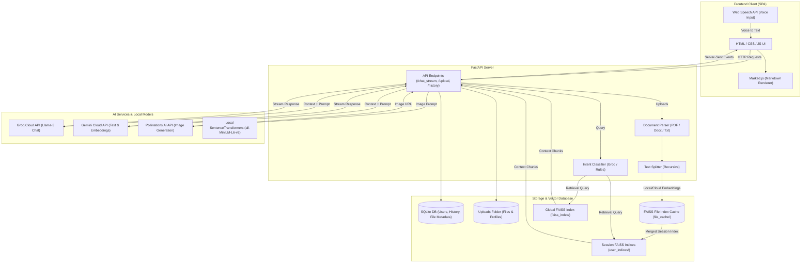
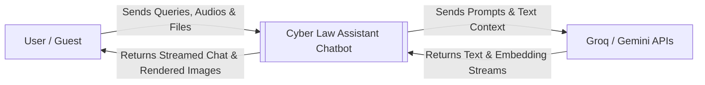
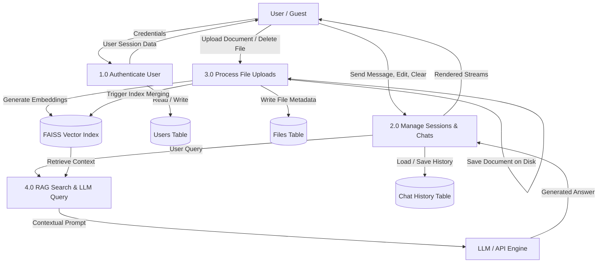
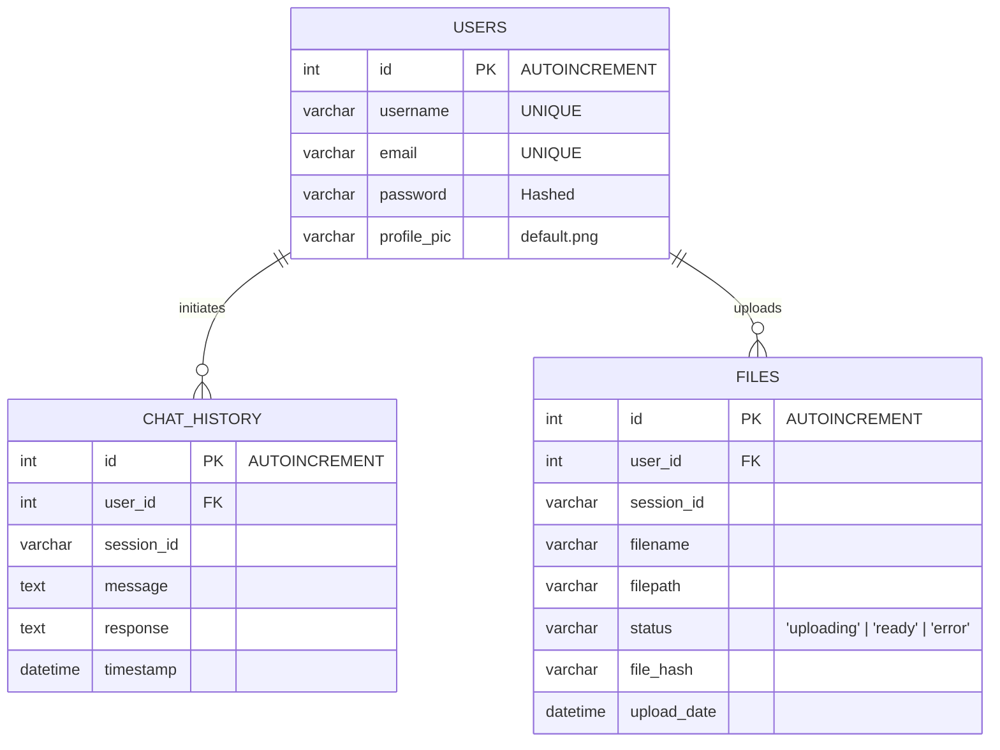

# Cyber Law Assistant Chatbot (CyberLex AI)
## Professional Project Documentation

---

## 1. Abstract
The **Cyber Law Assistant Chatbot (CyberLex AI)** is a full-stack, AI-powered conversational web application designed to democratize access to cyber law awareness and legal guidance in India. Built with a modern, premium frontend (HTML, CSS, JavaScript) and a FastAPI backend, the system utilizes **Retrieval-Augmented Generation (RAG)** combined with advanced Large Language Models (LLMs) like Llama-3 (via Groq) and Google Gemini. 

CyberLex AI retrieves relevant legal context from a curated dataset on the **Information Technology Act, 2000 (IT Act)** and user-uploaded documents (PDFs, DOCX, TXT) via a **FAISS vector store**. By processing queries in multiple linguistic formats (English, Tamil, and Tanglish) and supporting voice input, the assistant offers an accessible, interactive interface. The system ensures secure operations by cleaning database entries, physical file uploads, and session indexes upon history deletion.

---

## 2. Problem Statement
With the rapid acceleration of digital transactions and internet penetration in India, there is a concurrent exponential rise in cybercrimes, including online financial fraud, identity theft, cyberstalking, and digital arrest scams. However, public awareness regarding digital safety and legal recourse remains alarmingly low. 

The primary challenges are:
- **Complexity of Legal Jargon**: The Information Technology Act, 2000 (IT Act) is written in dense legal terminology that is difficult for a layperson to comprehend.
- **Resource Constraints**: Consulting legal professionals for initial guidance is expensive and time-consuming.
- **Delayed Reporting**: Victims often fail to report crimes within the critical "Golden Hour" (first 2 hours of financial fraud) due to ignorance of emergency helpline numbers (e.g., 1930) or reporting portals.
- **Unstructured Information**: Existing websites offer static, long-form FAQs rather than conversational, context-driven answers.

---

## 3. Existing System
The existing ecosystem for obtaining information on cyber laws consists of:
- **Static Government Portals**: Portals like *cybercrime.gov.in* provide raw forms and PDF guides but lack interactive diagnostic assistance.
- **Generic Search Engines (Google/Bing)**: Users search queries but receive page ranks, SEO-optimized blogs, or forum posts that can be misleading, outdated, or legally inaccurate.
- **Standard Legal Databases**: Systems like *Indian Kanoon* or *Manupatra* are optimized for legal practitioners, requiring knowledge of case laws, legal citations, and court procedures.
- **General LLMs (ChatGPT/Claude)**: Unmodified commercial LLMs suffer from "hallucination," fabricating non-existent sections, punishments, or laws, which poses a severe risk in legal contexts.

| Feature | Existing Systems | Proposed System (CyberLex AI) |
| :--- | :--- | :--- |
| **Interaction** | Static text / Search queries | Dynamic Conversational Chat |
| **Accuracy** | Search pages / Hallucinated AI | Fact-bounded RAG (SQLite + FAISS) |
| **Document Q&A**| Not supported | RAG on session-uploaded files |
| **Accessibility**| English-only text | Multilingual + Voice-to-Text |
| **Emergency Info**| Hard to locate | Prominent Golden Hour / 1930 prompts |

---

## 4. Proposed System
The proposed system, **CyberLex AI**, addresses these gaps by creating a conversational legal assistant:
- **Retrieval-Augmented Generation (RAG)**: Binds the LLM's responses strictly to a curated dataset of the IT Act, 2000 and official cyber safety rules.
- **Private Document Analysis**: Enables authenticated users to upload case-related files (contracts, threat emails, statements) which are parsed, split, and embedded into private session-specific FAISS vector indices to facilitate document-scoped Q&A.
- **Interactive Multi-Turn Chat**: Saves and manages chat history across multiple sessions. Users can edit past messages, auto-trimming history to maintain context without overflow.
- **Emergency Action Items**: Auto-detects intents of financial fraud or hacking to output callout banners highlighting the **1930 National Helpline** and **Golden Hour** guidelines.
- **Zero Resource Leakage**: Automatically garbage-collects physical files and FAISS indices from the server when a user deletes a session or clears their history.

---

## 5. Algorithm Used

### Retrieval-Augmented Generation (RAG) Pipeline
The RAG pipeline operates through a sequence of steps:
1. **Document Loading**: Text is extracted from PDFs (using `PyPDFLoader`), DOCX (using `Docx2txtLoader`), and raw TXT.
2. **Text Chunking**: The extracted text is parsed into overlapping segments using the `RecursiveCharacterTextSplitter` algorithm:
   $$\text{Chunk Size} = 600 - 800 \text{ characters}$$
   $$\text{Chunk Overlap} = 100 \text{ characters}$$
3. **Embedding Generation**: Text chunks are converted into dense vector representations.
   - *Local*: `all-MiniLM-L6-v2` transformer model (384-dimensional space).
   - *Cloud*: Gemini `text-embedding-004` (768-dimensional space).
4. **Vector Store Indexing**: Chunks are stored in a **FAISS** (Facebook AI Similarity Search) index.
5. **Similarity Search with Score Thresholding**: The query vector is compared against document vectors using L2 Euclidean distance:
   $$\text{Distance} = \sum_{i=1}^n (q_i - d_i)^2$$
   Only documents with a distance score $d < 1.35$ are retrieved as context, filtering out irrelevant chunks.
6. **Intent-Based LLM Prompt Routing**:
   ```
   If session has uploaded files:
       Query Private Session FAISS Index
       If relevant matches found:
           Generate response bounded ONLY to uploaded files
       Else:
           Fallback to Global Cyber Law FAISS Index + general legal LLM knowledge
   Else:
       Query Global Cyber Law FAISS Index
       Generate response using IT Act context + general legal LLM knowledge
   ```

---

## 6. System Specification

### Hardware Requirements
- **Processor**: Intel Core i5 / AMD Ryzen 5 or higher
- **System Memory (RAM)**: Minimum 8 GB (16 GB recommended for running local embeddings)
- **Disk Storage**: 500 MB minimum allocation (increases based on user file uploads)

### Software Requirements
- **Operating System**: Windows 10/11, macOS, or Linux (Ubuntu 20.04+)
- **Runtime Environment**: Python 3.10+
- **Database**: SQLite 3 (self-contained database file)
- **Web Technologies**: HTML5, CSS3 (Vanilla CSS with custom properties), JavaScript (ES6+)
- **Core Frameworks**: FastAPI (Python web framework), Uvicorn (ASGI server)
- **AI Libraries**: LangChain, FAISS CPU, HuggingFace Embeddings, Groq Client SDK

---

## 7. System Architecture
The system follows a decoupling architecture where the client UI communicates with a RESTful FastAPI backend.



---

## 8. Modules

### 1. User Management & Authentication Module
- **Registration**: Collects username, email, and password. Stores password hashes using `scrypt` via Werkzeug security.
- **Login**: Verifies credentials and creates a client-side user session in `localStorage`.
- **Profile Settings**: Enables users to update their profile information and upload custom avatars, which are saved in the `uploads/profiles/` directory.

### 2. Conversational Chat Module
- **Session Management**: Groups chat history under distinct, auto-generated session IDs.
- **Typewriter Streaming Interface**: Streams response chunks with Server-Sent Events (SSE), utilizing marked.js to render Markdown and process alert blocks (`[!NOTE]`, `[!TIP]`, `[!WARNING]`).
- **History Editing & Auto-Trimming**: Allows users to edit past messages in a thread. The server deletes all subsequent history from that message's index onwards, creating a clean fork of the conversation.
- **Voice Recognition Integration**: Uses the browser's Web Speech API (`webkitSpeechRecognition`) to support speech-to-text input.

### 3. Retrieval-Augmented Generation (RAG) Module
- **Document Processing**: Extracts text and builds cached, file-specific vector indexes.
- **Dynamic Session Index Merger**: Dynamically merges multiple file-specific indices into a single session-scoped FAISS vector index when queries are made or files are deleted.
- **Vector Search Engine**: Computes similarity scores and injects relevant paragraphs as raw context into the LLM system prompt.

### 4. Intent Classification & Routing Module
- **Conversational Classifier**: Employs a quick rule-based keyword filter and a zero-temperature Llama-3 model to categorize queries into:
  - *Cyber Law Question*, *Cyber Security Question*, *Uploaded Document Question*, *General Knowledge*, *Casual Conversation*, or *Image Generation*.
- **API Fallback Router**: Prioritizes local embeddings and Groq chat APIs, gracefully falling back to Gemini or SQLite databases if external services are unreachable.

---

## 9. Data Flow Diagram

### Level 0 DFD (System Context Diagram)


### Level 1 DFD (Data Flow Decomposition)


---

## 10. Usecase Diagram
The Usecase diagram shows the actors (User, Guest) and their interactions with the system's core capabilities.

```mermaid
leftToRightDirection
gcclass UsecaseDiagram
    actor Guest as "Guest User (Unauthenticated)"
    actor User as "Registered User (Authenticated)"

    rectangle CyberLex_AI_System {
        usecase UC_Reg as "Register Account"
        usecase UC_Log as "Login"
        usecase UC_Chat as "Casual Chat & Ask Cyber Law"
        usecase UC_Voice as "Voice Input"
        usecase UC_Lang as "Toggle Interface Language"
        usecase UC_Hist as "Save Chat History & Manage Sessions"
        usecase UC_Edit as "Edit Message & Fork History"
        usecase UC_Upload as "Upload Documents (PDF / DOCX / TXT)"
        usecase UC_DocQA as "Q&A on Uploaded Files"
        usecase UC_Profile as "Update Profile & Photo"
        usecase UC_Clear as "Clear All Chats"
        usecase UC_Img as "Generate Cyber Art Images"
    }

    %% Guest Associations
    Guest --> UC_Reg
    Guest --> UC_Log
    Guest --> UC_Chat
    Guest --> UC_Voice
    Guest --> UC_Lang
    Guest --> UC_Img

    %% User Associations
    User --> UC_Chat
    User --> UC_Voice
    User --> UC_Lang
    User --> UC_Hist
    User --> UC_Edit
    User --> UC_Upload
    User --> UC_DocQA
    User --> UC_Profile
    User --> UC_Clear
    User --> UC_Img
```

---

## 11. Entity Relationship (ER) Diagram
The ER Diagram details the relational schema stored in the SQLite database (`chatbot.db`).



---

## 12. Conclusion
CyberLex AI successfully bridges the gap between complex cyber laws and public understanding. By packaging a powerful RAG pipeline into an intuitive, responsive user interface, it provides immediate legal guidance regarding the IT Act 2000. 

### Future Scope
- **Official API Integrations**: Directly link with the National Cyber Crime reporting portal to help users file drafts of FIR complaints.
- **Fine-Tuning on Case Laws**: Fine-tune an open-source model (e.g., Llama-3-8B) on Indian Supreme Court and High Court cyber law rulings to provide case-reference answers.
- **Voice Response Synthesizer**: Add text-to-speech features so users can hear responses in regional languages.

---

## 13. References
1. **Information Technology Act, 2000 (IT Act)**: *Ministry of Electronics and Information Technology, Government of India*.
2. **National Cyber Crime Reporting Portal**: *Ministry of Home Affairs, Government of India* (www.cybercrime.gov.in).
3. **LangChain Documentation**: *Structuring RAG pipelines and loaders* (https://python.langchain.com).
4. **FAISS (Facebook AI Similarity Search)**: *Billion-scale similarity search with GPUs/CPUs* (https://github.com/facebookresearch/faiss).
5. **FastAPI Web Framework**: *Fast, high-performance Python ASGI development* (https://fastapi.tiangolo.com).
